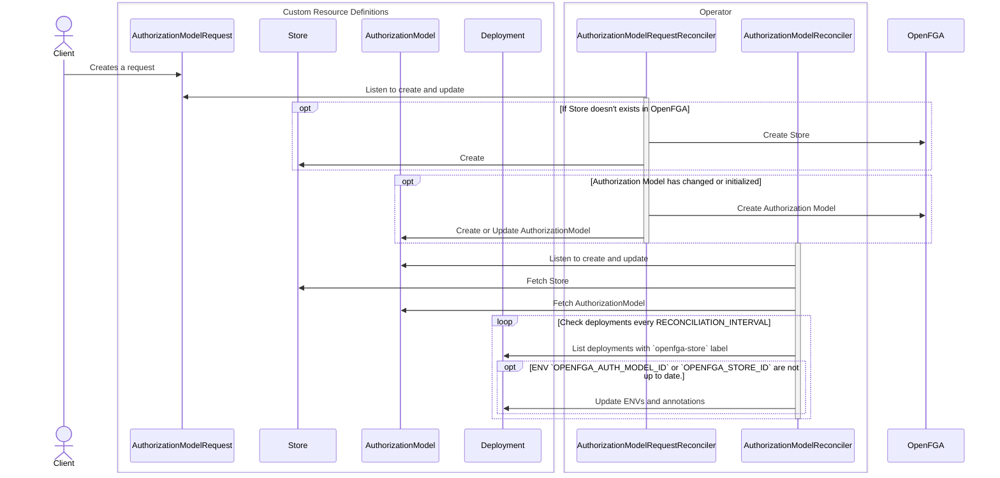

# FGA Operator Documentation

This documentation helps you deploy an OpenFGA authorization model and ensures your deployments stay in sync with the latest authorization model from OpenFGA. The FGA operator automates the synchronization between your deployments and the authorization models.

## Steps

### 1. Create an Authorization Model

Make an authorization request:

```yaml
apiVersion: extensions.fga-operator/v1
kind: AuthorizationModelRequest
metadata:
  name: documents
spec:
  instances:
    - version:
        major: 1
        minor: 1
        patch: 1
      authorizationModel: |
        model
          schema 1.1
          
        type user
          
        type document
          relations
            define reader: [user]
            define writer: [user]
            define owner: [user]
```

This request will:
- Create a store with the same name in OpenFGA.
- Create a Kubernetes resource `Store`.

```yaml
apiVersion: extensions.fga-operator/v1
kind: Store
metadata:
  labels:
    authorization-model: documents
  name: documents
  namespace: default
  ownerReferences:
  - apiVersion: extensions.fga-operator/v1
    blockOwnerDeletion: true
    controller: true
    kind: AuthorizationModelRequest
    name: documents
    uid: <SOME_ID>
spec:
  id: 01J1N8HCY7MQP4QP3GVDWTM9ZG

```

- Create the authorization model in OpenFGA.
- Save the authorization model ID in a Kubernetes resource `AuthorizationModel`.

```yaml
apiVersion: extensions.fga-operator/v1
kind: AuthorizationModel
metadata:
  labels:
    authorization-model: documents
  name: documents
  namespace: default
  ownerReferences:
  - apiVersion: extensions.fga-operator/v1
    blockOwnerDeletion: true
    controller: true
    kind: AuthorizationModelRequest
    name: documents
    uid: <SOME_ID>
spec:
  instances:
  - authorizationModel: |
      model
        schema 1.1

      type user

      type document
        relations
          define reader: [user]
          define writer: [user]
          define owner: [user]  
    createdAt: "2024-07-06T06:44:24Z"
    id: 01J23CJTA8X4K87X62ECX1Y58Z
    version:
      major: 1
      minor: 1
      patch: 1
```

### 2. Deployment with Label

Given a deployment with the label `openfga-store` set to the name of the authorization request:

```yaml
apiVersion: apps/v1
kind: Deployment
metadata:
  labels:
    openfga-store: documents
    app: annotated-curl
  name: annotated-curl
spec:
  replicas: 1
  selector:
    matchLabels:
      app: annotated-curl
  template:
    metadata:
      labels:
        app: annotated-curl
    spec:
      containers:
      - name: main
        image: curlimages/curl:8.7.1
        command: ["sleep", "9999999"]
```

The environment variable `OPENFGA_AUTH_MODEL_ID` will be set to the latest created authorization model ID from OpenFGA.

```yaml
apiVersion: apps/v1
kind: Deployment
metadata:
  annotations:
    openfga-auth-id-updated-at: "2024-07-06T06:44:24Z"
    openfga-auth-model-version: 1.1.1
    openfga-store-id-updated-at: "2024-07-06T06:44:24Z"
  labels:
    app: annotated-curl
    openfga-store: documents
  name: annotated-curl
  namespace: default
spec:
  replicas: 1
  selector:
    matchLabels:
      app: annotated-curl
  template:
    metadata:
      labels:
        app: annotated-curl
    spec:
      containers:
      - command:
        - sleep
        - "9999999"
        env:
        - name: OPENFGA_STORE_ID
          value: 01J1N8HCY7MQP4QP3GVDWTM9ZG
        - name: OPENFGA_AUTH_MODEL_ID
          value: 01J23CJTA8X4K87X62ECX1Y58Z
        image: curlimages/curl:8.7.1
        imagePullPolicy: IfNotPresent
        name: main
````

### 3. Update the Authorization Model
To update the authorization model, make a request like below. The important part is setting a new version since this is what the controller compares.

```yaml
apiVersion: extensions.fga-operator/v1
kind: AuthorizationModelRequest
metadata:
  name: documents
spec:
  instances:
    - version:
        major: 1
        minor: 1
        patch: 2
      authorizationModel: |
        model
          schema 1.1
        
        type user
        
        type document
          relations
            define foo: [user]
            define reader: [user]
            define writer: [user]
            define owner: [user]
    - version:
        major: 1
        minor: 1
        patch: 1
      authorizationModel: |
        model
          schema 1.1
          
        type user
          
        type document
          relations
            define reader: [user]
            define writer: [user]
            define owner: [user]
```

The controller will call OpenFGA and create the new authorization model. The controller will update the AuthorizationModel with the new reference.

```yaml
apiVersion: extensions.fga-operator/v1
kind: AuthorizationModel
metadata:
  creationTimestamp: "2024-07-06T06:44:25Z"
  generation: 2
  labels:
    authorization-model: documents
  name: documents
  namespace: default
  ownerReferences:
  - apiVersion: extensions.fga-operator/v1
    blockOwnerDeletion: true
    controller: true
    kind: AuthorizationModelRequest
    name: documents
    uid: e507bff2-09b2-44d7-9f2e-b6f238dda3b3
  resourceVersion: "734046"
  uid: 6c0ab77c-765b-40d1-8372-77a5cefb325e
spec:
  instances:
  - authorizationModel: |
      model
        schema 1.1

      type user

      type document
        relations
          define reader: [user]
          define writer: [user]
          define owner: [user]
    createdAt: "2024-07-06T06:44:24Z"
    id: 01J23CJTA8X4K87X62ECX1Y58Z
    version:
      major: 1
      minor: 1
      patch: 1
  - authorizationModel: |
      model
        schema 1.1

      type user

      type document
        relations
          define foo: [user]
          define reader: [user]
          define writer: [user]
          define owner: [user]
    createdAt: "2024-07-06T06:50:37Z"
    id: 01J23CY66445FA3Z6TQEC9WBZK
    version:
      major: 1
      minor: 1
      patch: 2
```

The controller will update annotated deployments so that the example deployment will have its `OPENFGA_AUTH_MODEL_ID` environment variable updated.

```yaml
apiVersion: apps/v1
kind: Deployment
metadata:
  annotations:
    openfga-auth-id-updated-at: "2024-07-06T06:50:37Z"
    openfga-auth-model-version: 1.1.2
    openfga-store-id-updated-at: "2024-07-06T06:44:24Z"
  labels:
    app: annotated-curl
    openfga-store: documents
  name: annotated-curl
  namespace: default
spec:
  replicas: 1
  selector:
    matchLabels:
      app: annotated-curl
  template:
    metadata:
      labels:
        app: annotated-curl
    spec:
      containers:
      - command:
        - sleep
        - "9999999"
        env:
        - name: OPENFGA_STORE_ID
          value: 01J1N8HCY7MQP4QP3GVDWTM9ZG
        - name: OPENFGA_AUTH_MODEL_ID
          value: 01J23CY66445FA3Z6TQEC9WBZK
        image: curlimages/curl:8.7.1
        imagePullPolicy: IfNotPresent
        name: main
```

### 4. Set a Specific Version on Deployment

To lock the `OPENFGA_AUTH_MODEL_ID` to a specific user-provided version, add the label `openfga-auth-model-version` and set it to the desired version.

```yaml
apiVersion: apps/v1
kind: Deployment
metadata:
  labels:
    openfga-store: documents
    openfga-auth-model-version: "1.1.1"
    app: annotated-curl
  name: annotated-curl
spec:
  replicas: 1
  selector:
    matchLabels:
      app: annotated-curl
  template:
    metadata:
      labels:
        app: annotated-curl
    spec:
      containers:
      - name: main
        image: curlimages/curl:8.7.1
        command: ["sleep", "9999999"]
```

By applying the above, the `OPENFGA_AUTH_MODEL_ID` will be set to the authorization model ID with version label `1.1.1`.

```yaml
apiVersion: apps/v1
kind: Deployment
metadata:
  annotations:
    openfga-auth-id-updated-at: "2024-07-06T07:01:40Z"
    openfga-auth-model-version: 1.1.1
    openfga-store-id-updated-at: "2024-07-06T06:44:24Z"
  labels:
    app: annotated-curl
    openfga-auth-model-version: 1.1.1
    openfga-store: documents
  name: annotated-curl
  namespace: default
spec:
  replicas: 1
  selector:
    matchLabels:
      app: annotated-curl
  template:
    metadata:
      labels:
        app: annotated-curl
    spec:
      containers:
      - command:
        - sleep
        - "9999999"
        env:
        - name: OPENFGA_STORE_ID
          value: 01J1N8HCY7MQP4QP3GVDWTM9ZG
        - name: OPENFGA_AUTH_MODEL_ID
          value: 01J23CJTA8X4K87X62ECX1Y58Z
        image: curlimages/curl:8.7.1
        imagePullPolicy: IfNotPresent
        name: main
```

## Migration Guide for Using Operator with Existing Models

If you have existing stores and authorization models and wish to migrate to use the operator without deploying a new authorization model or store, you can retain the existing ones. Creating new models would require reconciling all existing relationship tuples, which might not be desirable.

To address this, the `AuthorizationModelRequest` resource provides the properties `existingStoreId` and `existingAuthorizationModelId`, allowing you to reuse your current setup.

Example configuration:
```yaml
apiVersion: extensions.fga-operator/v1
kind: AuthorizationModelRequest
metadata:
  name: documents
spec:
  existingStoreId: 01J1N8HCY7MQP4QP3GVDWTM9ZG
  instances:
    - version:
        major: 1
        minor: 1
        patch: 1
      existingAuthorizationModelId: 01J23CJTA8X4K87X62ECX1Y58Z
      authorizationModel: |
        model
          schema 1.1
          
        type user
          
        type document
          relations
            define reader: [user]
            define writer: [user]
            define owner: [user]
```

In this configuration, the operator will **not** create a store and authorization model in OpenFGA. It will only handle the creation of Custom Resource Definitions (CRDs), such as `AuthorizationModel` and `Store`, and perform the necessary deployment updates.

## Installation using Helm

To install the Helm chart for fga-operator, follow the steps below:

Add Helm Repository:

```sh
helm repo add fga-operator https://3schwartz.github.io/fga-operator/
helm repo update
```

Search for the chart
```sh
helm search repo fga --devel
```

Install the Chart:
```sh
helm install fga-operator fga-operator/fga-operator --version <CHOOSE_VERSION>
```

Verify Installation:
```sh
helm list
```

The helm chart can be added as a chart dependency in `Chart.yaml`:
```
...
dependencies:
- name: fga-operator
  version: "<CHOOSE_VERSION>"
  repository: https://3schwartz.github.io/fga-operator/
```

## Configurations

Configurations can be set using either command-line flags or environment variables.

### Command line flags

All command line flags has defaults and hence none of them are mandatory.

| Name                      | Description                                                                                                                                                                      | Default Image | Default Helm Chart |
|---------------------------|----------------------------------------------------------------------------------------------------------------------------------------------------------------------------------|---------------|--------------------|
| metrics-bind-address      | The address the metric endpoint binds to. Setting it to "0" will disable the endpoint.                                                                                           | ":8080"       | 0                  |
| health-probe-bind-address | The address the probe endpoint binds to.                                                                                                                                         | ":8081"       | 8081               |
| leader-elect              | Enable leader election for controller manager. Enabling this will ensure there is only one active controller manager.                                                            | false         | true               |
| metrics-secure            | If set the metrics endpoint is served securely.                                                                                                                                  | false         | false              |
| enable-http2              | If set, HTTP/2 will be enabled for the metrics and webhook servers                                                                                                               | false         | false              |
| zap-devel                 | configures the logger to use a Zap development config (stacktraces on warnings, no sampling), otherwise a Zap production  config will be used (stacktraces on errors, sampling). | true          | false              |

### Environment Variables

| Name                    | Description                                                                                                   | Default | Mandatory | Examples                                                              |
|-------------------------|---------------------------------------------------------------------------------------------------------------|---------|-----------|-----------------------------------------------------------------------|
| OPENFGA_API_URL         | Url to OpenFGA.                                                                                               | -       | Yes       | "http://127.0.0.1:8089", "http://openfga.demo.svc.cluster.local:8080" |
| OPENFGA_API_TOKEN       | Preshared key used for authentication to OpenFGA.                                                             | -       | Yes       | "foobar", "some_token"                                                |


## Events

This table outlines the events emitted by the controllers during the reconciliation process, along with their type and description.

| Reason                               | Type    | Controller                          | Description                                                                    | CRD                                    |
|--------------------------------------|---------|-------------------------------------|--------------------------------------------------------------------------------|----------------------------------------|
| StoreFetchFailure                    | Warning | AuthorizationModelReconciler        | Triggered when the store resource cannot be fetched during reconciliation.     | `AuthorizationModel`                   |
| AuthorizationModelIdUpdateFailed     | Warning | AuthorizationModelReconciler        | Emitted when finding the correct Authorization Model id on a deployment fails. | `AuthorizationModel`<br/> `Deployment` |
| FailedListingDeployments             | Warning | AuthorizationModelReconciler        | Raised when there is an issue listing deployments during reconciliation.       | `AuthorizationModel`                   |
| FailedUpdatingDeployment             | Warning | AuthorizationModelReconciler        | Emitted when a deployment update fails during reconciliation.                  | `AuthorizationModel`<br/> `Deployment` |
| AuthorizationModelStatusChangeFailed | Warning | AuthorizationModelRequestReconciler | Triggered when the status update for an AuthorizationModelRequest fails.       | `AuthorizationModelRequest`            |
| ClientInitializationFailed           | Warning | AuthorizationModelRequestReconciler | Emitted when the OpenFGA client initialization fails.                          | `AuthorizationModelRequest`            |
| StoreFailed                          | Warning | AuthorizationModelRequestReconciler | Raised when there is an issue creating or fetching the store from OpenFGA.     | `AuthorizationModelRequest`            |
| AuthorizationModelCreationFailed     | Warning | AuthorizationModelRequestReconciler | Triggered when the creation of the AuthorizationModel in OpenFGA fails.        | `AuthorizationModelRequest`            |
| AuthorizationModelUpdateFailed       | Warning | AuthorizationModelRequestReconciler | Emitted when the update of an AuthorizationModel in Kubernetes fails.          | `AuthorizationModelRequest`            |

## Status

### AuthorizationModelRequest

This table describes the possible statuses for the `AuthorizationModelRequest` resource during its lifecycle.

|        Status         | Description                                                                                                             |
|:---------------------:|:------------------------------------------------------------------------------------------------------------------------|
|        Pending        | Indicates that the request has been created but has not yet started processing.                                         |
|     Synchronizing     | Indicates that the request is actively being processed (e.g., creating or updating resources in OpenFGA or Kubernetes). |
|     Synchronized      | Indicates that the request has been successfully reconciled, and all resources are up to date.                          |
| SynchronizationFailed | Set when the synchronization process fails due to errors in OpenFGA or Kubernetes operations.                           |


## Reconciliation Design

This design outlines the interaction between the client, custom resource definitions (CRDs), and the operator for managing OpenFGA Stores and Authorization Models.



### Steps

#### Client Request
- The client creates an `AuthorizationModelRequest`.

#### `AuthorizationModelRequestReconciler` Request Reconciliation:
- The `AuthorizationModelRequestReconciler` listens for create/update events on `AuthorizationModelRequest`.
- If the corresponding **Store** doesn't exist in OpenFGA:
   - The operator creates the store in OpenFGA and in Kubernetes (**Store** resource).
- If the **Authorization Model** has changed or is being initialized:
   - The operator creates the Authorization Model in OpenFGA and create or updates the `AuthorizationModel` resource in Kubernetes.

#### `AuthorizationModelReconciler` Model Reconciliation:
- The `AuthorizationModelReconciler` listens for create/update events on `AuthorizationModel`.
- It fetches the `Store` and the `AuthorizationModel` resources.
- Every `RECONCILIATION_INTERVAL`, it checks deployments with the `openfga-store` label:

  - If the environment variables `OPENFGA_AUTH_MODEL_ID` or `OPENFGA_STORE_ID` are outdated, the operator updates the deployment's environment variables and annotations:
    - Environment Variables:
        - `OPENFGA_AUTH_MODEL_ID`
        - `OPENFGA_STORE_ID`
    - Annotations:
      - `openfga-auth-id-updated-at`
      - `openfga-store-id-updated-at`
      - `openfga-auth-model-version` 

This flow ensures that OpenFGA stores and authorization models are kept in sync with Kubernetes deployments.
